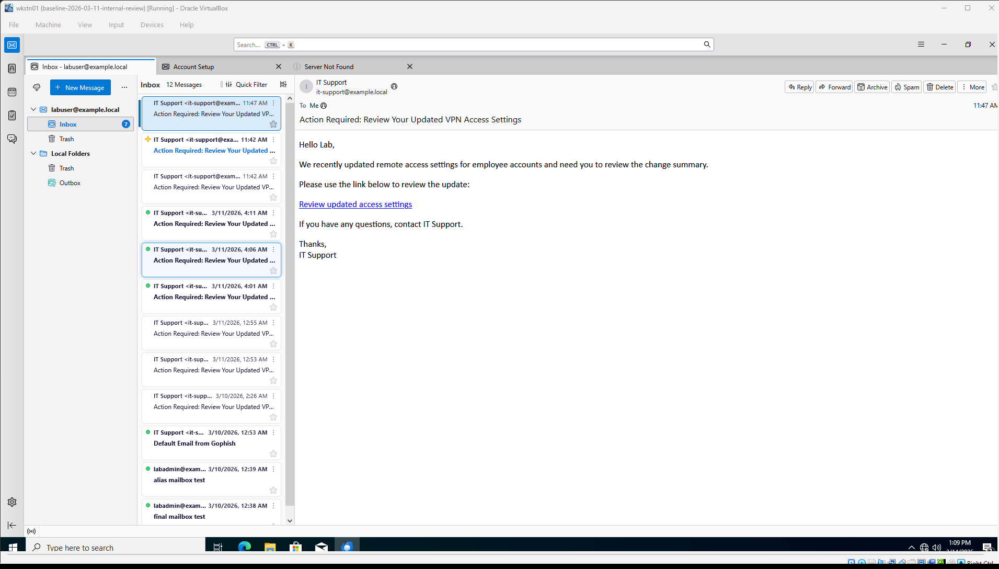

# Phishing Lab



Windows-side workspace for the phishing simulation extension to the Enterprise AD lab. All six project phases are complete as of March 14, 2026.

## Project Summary

A controlled phishing campaign was delivered through `mail01` to `labuser@example.local`, opened on `wkstn01`, and clicked to `gophish01`. Custom Wazuh detection rules were engineered to produce primitive alerts for email delivery, IMAP access, and link click, plus a correlated multi-event incident alert. Live validation confirmed the full detection path on March 14, 2026.

## Start Here

- Project status: [docs/PROJECT_STATUS.md](docs/PROJECT_STATUS.md)
- Phase-by-phase overview: [docs/PROJECT_PHASE_OVERVIEW.md](docs/PROJECT_PHASE_OVERVIEW.md)
- Sprint progress review: [docs/SPRINT_PROGRESS_INTERNAL_REVIEW.md](docs/SPRINT_PROGRESS_INTERNAL_REVIEW.md)

## Sprint Deliverables

| Sprint | Document |
|--------|----------|
| Sprint 1 — Baseline Validation | [docs/SPRINT1_VALIDATION.md](docs/SPRINT1_VALIDATION.md) |
| Sprint 2 — Evidence and Timeline | [docs/SPRINT2_EVIDENCE_AND_TIMELINE.md](docs/SPRINT2_EVIDENCE_AND_TIMELINE.md) |
| Sprint 3 — Detection Engineering | [docs/SPRINT3_DETECTION_ENGINEERING.md](docs/SPRINT3_DETECTION_ENGINEERING.md) |
| Sprint 5 — Incident Response | [docs/SPRINT5_INCIDENT_RESPONSE.md](docs/SPRINT5_INCIDENT_RESPONSE.md) |
| Sprint 6 — Project Closeout | [docs/SPRINT6_PROJECT_CLOSEOUT.md](docs/SPRINT6_PROJECT_CLOSEOUT.md) |

## Repository Layout

```text
ansible/
  playbook-staging.yml
docs/
  PROJECT_STATUS.md
  PROJECT_PHASE_OVERVIEW.md
  SPRINT_PROGRESS_INTERNAL_REVIEW.md
  SPRINT_PLAN.md
  SPRINT5_6_HANDOFF.md
  SPRINT1_VALIDATION.md
  SPRINT2_EVIDENCE_AND_TIMELINE.md
  SPRINT3_DETECTION_ENGINEERING.md
  SPRINT5_INCIDENT_RESPONSE.md
  SPRINT6_PROJECT_CLOSEOUT.md
  SESSION_REPORT.md
  assets/screenshots/
scripts/
  windows/
  linux/
artifacts/
  installers/
wazuh/
  rules/
  decoders/
  agents/
```

## Key Scripts

- VM start script: [scripts/windows/start-vms.ps1](scripts/windows/start-vms.ps1)
- Postfix fix: [scripts/linux/fix-postfix.sh](scripts/linux/fix-postfix.sh)
- Local staging playbook: [ansible/playbook-staging.yml](ansible/playbook-staging.yml)
- Production playbook (WSL): `/home/linux/enterprise-ad-lab/ansible/playbooks/02-provision-phishing-lab.yml`

## Validated Access

- GoPhish admin: `https://<gophish_ip>:3333`
- GoPhish credentials: `admin` / `<redacted>`
- Mailbox: `labuser@example.local`
- IMAP host: `<mail_ip>` — user `labuser` / `<redacted>`

## Detection Rules

Custom Wazuh content is in [wazuh/](wazuh/). The three active rules are:

| Rule ID | Description |
|---------|-------------|
| 100101 | Phishing email delivered via Dovecot |
| 100102 | IMAP login to phishing mailbox |
| 100104 | Correlated incident — delivery followed by link click |

## Known Limitations

- `aws-eks-authenticator` decoder intercepts GoPhish log lines; the click rule works around this
- No host-based telemetry on `wkstn01` (browser process, DNS, network)
- No credential harvest or post-click payload coverage
