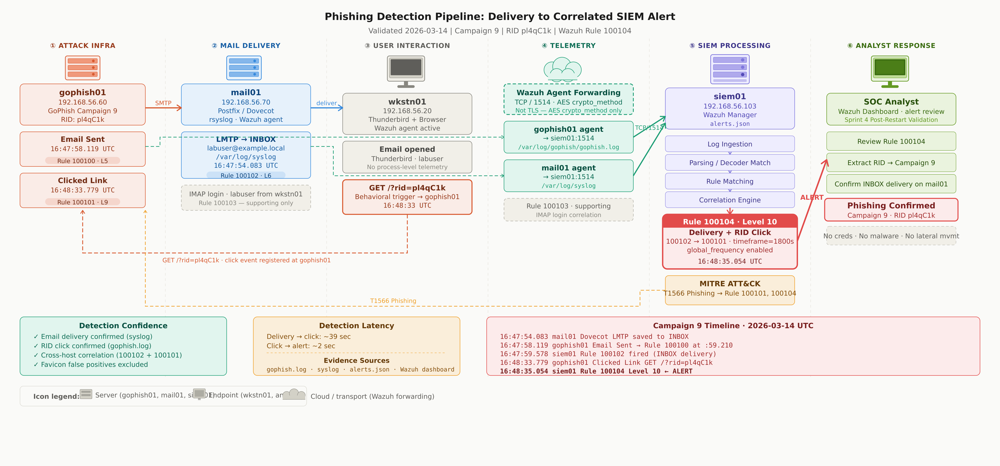

# Phishing Lab



Windows-side workspace for the phishing simulation extension to the Enterprise AD lab. All six project phases are complete as of March 14, 2026.

## Project Summary

A controlled phishing campaign was delivered through a local mail relay to a lab workstation. The workstation opened the email and clicked the embedded phishing link. Custom Wazuh detection rules were engineered to produce primitive alerts for email send, mailbox delivery, IMAP access, and link click, plus a correlated multi-event incident alert. Live validation confirmed the full detection path on March 14, 2026.

## Start Here

- Project status: [docs/PROJECT_STATUS.md](docs/PROJECT_STATUS.md)
- Phase-by-phase overview: [docs/PROJECT_PHASE_OVERVIEW.md](docs/PROJECT_PHASE_OVERVIEW.md)
- Sprint progress review: [docs/SPRINT_PROGRESS_INTERNAL_REVIEW.md](docs/SPRINT_PROGRESS_INTERNAL_REVIEW.md)

## Sprint Deliverables

| Sprint | Document |
|--------|----------|
| Sprint 1 — Baseline Validation | [docs/SPRINT1_VALIDATION.md](docs/SPRINT1_VALIDATION.md) |
| Sprint 2 — Evidence and Timeline | [docs/SPRINT2_EVIDENCE_AND_TIMELINE.md](docs/SPRINT2_EVIDENCE_AND_TIMELINE.md) |
| Sprint 3 — Detection Engineering | [docs/SPRINT3_DETECTION_ENGINEERING.md](docs/SPRINT3_DETECTION_ENGINEERING.md) |
| Sprint 4 — Correlation and Live Validation | [docs/PROJECT_PHASE_OVERVIEW.md](docs/PROJECT_PHASE_OVERVIEW.md) (Phase 4 section) |
| Sprint 5 — Incident Response | [docs/SPRINT5_INCIDENT_RESPONSE.md](docs/SPRINT5_INCIDENT_RESPONSE.md) |
| Sprint 6 — Project Closeout | [docs/SPRINT6_PROJECT_CLOSEOUT.md](docs/SPRINT6_PROJECT_CLOSEOUT.md) |

## Repository Layout

```text
wazuh/
  rules/phishing_lab_rules.xml       ← custom detection rules
  decoders/phishing_lab_decoders.xml ← custom decoders
  agents/gophish01-ossec.conf        ← agent log collection config
  agents/mail01-ossec.conf
docs/
  SPRINT1_VALIDATION.md
  SPRINT2_EVIDENCE_AND_TIMELINE.md
  SPRINT3_DETECTION_ENGINEERING.md
  SPRINT5_INCIDENT_RESPONSE.md
  SPRINT6_PROJECT_CLOSEOUT.md
  PROJECT_STATUS.md
  PROJECT_PHASE_OVERVIEW.md
  SPRINT_PROGRESS_INTERNAL_REVIEW.md
  assets/screenshots/
scripts/
  linux/deploy-wazuh-phishing-rules.sh  ← deploys wazuh content to lab VMs
  linux/run-wazuh-logtest.sh            ← runs logtest samples against rules
  linux/fix-postfix.sh
  windows/start-vms.ps1
  windows/configure-vm.ps1
ansible/
  playbook-staging.yml
```

## Core Detection Artifacts

| File | Purpose |
|------|---------|
| [wazuh/rules/phishing_lab_rules.xml](wazuh/rules/phishing_lab_rules.xml) | Rules 100100–100104 — the complete phishing detection set |
| [wazuh/decoders/phishing_lab_decoders.xml](wazuh/decoders/phishing_lab_decoders.xml) | Custom decoder definitions used alongside the rules |
| [wazuh/agents/gophish01-ossec.conf](wazuh/agents/gophish01-ossec.conf) | Agent log collection config for the GoPhish host |
| [wazuh/agents/mail01-ossec.conf](wazuh/agents/mail01-ossec.conf) | Agent log collection config for the mail host |
| [scripts/linux/deploy-wazuh-phishing-rules.sh](scripts/linux/deploy-wazuh-phishing-rules.sh) | Deploys rules, decoders, and agent configs to the running lab VMs |
| [scripts/linux/run-wazuh-logtest.sh](scripts/linux/run-wazuh-logtest.sh) | Validates rules against named log samples via `wazuh-logtest` |

## Detection Rules


| Rule ID | Description |
|---------|-------------|
| 100100 | GoPhish email sent to target |
| 100101 | GoPhish RID click detected |
| 100102 | Dovecot mailbox delivery confirmed |
| 100103 | Dovecot IMAP login from workstation |
| 100104 | Correlated incident — mailbox delivery followed by RID click |

Rule `100104` is the high-confidence incident indicator. It requires both a prior delivery event and a real RID click within a 30-minute window across agents.

**Live proof — rule 100104 firing in Wazuh on 2026-03-14:**


## Accepted Scope Limitations

These are real constraints on what the project proves, not open bugs:

- Rule `100100` depends on the `aws-eks-authenticator` decoder Wazuh currently assigns to GoPhish log lines — a dedicated decoder would remove this fragility
- No credential harvest step — the landing page is informational only; no credential submission rule exists
- No host-based telemetry on the workstation — post-click process and network activity is not visible to the SIEM
- Lab scale only — four-VM closed network; not validated against real traffic volumes or evasion techniques

See [docs/SPRINT6_PROJECT_CLOSEOUT.md](docs/SPRINT6_PROJECT_CLOSEOUT.md) for the full limitations and recommended future improvements.
